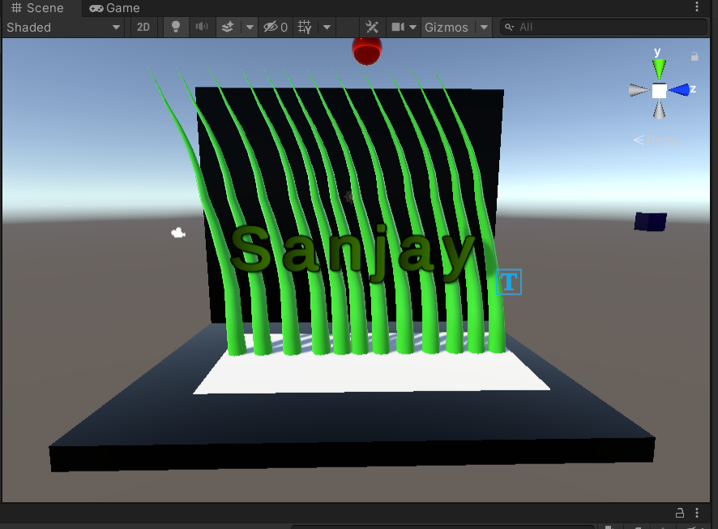

# Ex.No:1  Rotating the Gaming Object

## Aim:
To develop a 3D application for rotating the gaming objects in unity.
## Algorithm:
### Step 1:
&emsp;Start
### Step 2:
1. Click File -> Scene -> Select the scene -> Save as-> New folder(Scenes)-> File name (Exp1)
### Step 3:
1. Click Hierarchy -> 3DObject -> Cylinder
2. Hierarchy -> 3DObject -> Capsule
3. Hierarchy -> 3DObject -> Text
4. Hierarchy -> Effects -> Particle system
### Step 4:
1. Create a folder in project and name as Materials
2. Material folder -> Create -> Material (Name: Capsule)
3. Inspector ->Surface Inputs ->BaseMAp (Choose the color)
4. Drag the Cylinder to the plane and release the mouse
### Step 5:
1. Click Hierarchy -> DirectionalLight
2. Inspector -> Change the color to white (255,255,255)
### Step 6:
&emsp;Create a folder name Coding and create a C# file to add the coding in it.
### Step 7:
&emsp;To add our C# Script file to our selected object, click on the C# Script file and drag it to our selected objects in the Hierarchy window nad run the application.
### Step 8:
&emsp;Stop

## Program:
```
Program created by: Sanjay Kumar S S
Register number: 212221240048
```
### Rotate Along Y-Axis(Sphere):
```C#
using System.Collections;
using System.Collections.Generic;
using UnityEngine;

public class Sphere : MonoBehaviour
{
    // Start is called before the first frame update
    void Start()
    {
        
    }

    // Update is called once per frame
    void Update()
    {
        transform.RotateAround(Vector3.up, Vector3.right, 90 * Time.deltaTime);
    }
}

```
### Rotate Along X-Axis(Cube):
```C#
using System.Collections;
using System.Collections.Generic;
using UnityEngine;

public class Cube : MonoBehaviour
{
    // Start is called before the first frame update
    void Start()
    {
        
    }

    // Update is called once per frame
    void Update()
    {
        transform.RotateAround(Vector3.right, Vector3.down, 90 * Time.deltaTime);
    }
}
```
## Output:


https://user-images.githubusercontent.com/93427017/225445370-d28d41da-6c5a-4fa1-a7c7-dea8d6587a7c.mp4


## Result:
Thus a 3D application for rotating the gaming objects in unity is developed successfully.
